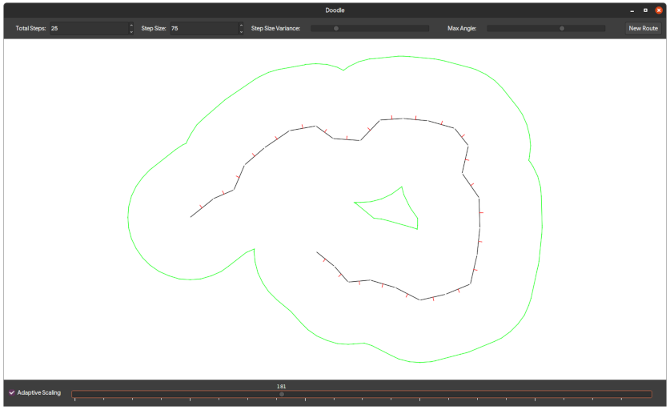

# Kotlin Doodles

[](https://kotlinlang.org/)

A couple of experiments using Java 2D graphics and constructive area geometry.

Launch the application with... 
```
./gradlew run
```

## Route Corridor Generator



- Total steps: controls the number of steps the path generator performs, keep below 500 for interactive frame rates.
- Step size: controls the size of each step.
- Step size variance: controls the randomness of the step size.
- Max angle: sets the max angle when choosing where to go next.
- New Route: generates a new random route.
- Adaptive scaling: zoom the viewport in or out to keep the entire route and corridor visible.
- Radius slider: controls the size of the corridor.

## Constructive Area Geometry Playground


Pressing ESCAPE cancels any active operation.

Edit mode interaction:

- Left mouse and drag to move shapes
- Right mouse and drag to rotate shapes
- Press shift and drag with left mouse to box select
- Press shift and left click to select all shapes under cursor
- Press shift and drag with right mouse to box deselect
- Press shift and right click to deselect all shapes under cursor

Create shape interaction:
- Click and drag shape to create

Boolean interaction:
- First shape selected is target shape
- Other shapes selected are operands of boolean operation applied in sequence

## License

Copyright © 2020 Jean d'Arc

Permission is hereby granted, free of charge, to any person obtaining a copy of this software and associated documentation files (the “Software”), to deal in the Software without restriction, including without limitation the rights to use, copy, modify, merge, publish, distribute, sublicense, and/or sell copies of the Software, and to permit persons to whom the Software is furnished to do so, subject to the following conditions:

The above copyright notice and this permission notice shall be included in all copies or substantial portions of the Software.

THE SOFTWARE IS PROVIDED “AS IS”, WITHOUT WARRANTY OF ANY KIND, EXPRESS OR IMPLIED, INCLUDING BUT NOT LIMITED TO THE WARRANTIES OF MERCHANTABILITY, FITNESS FOR A PARTICULAR PURPOSE AND NONINFRINGEMENT. IN NO EVENT SHALL THE AUTHORS OR COPYRIGHT HOLDERS BE LIABLE FOR ANY CLAIM, DAMAGES OR OTHER LIABILITY, WHETHER IN AN ACTION OF CONTRACT, TORT OR OTHERWISE, ARISING FROM, OUT OF OR IN CONNECTION WITH THE SOFTWARE OR THE USE OR OTHER DEALINGS IN THE SOFTWARE.